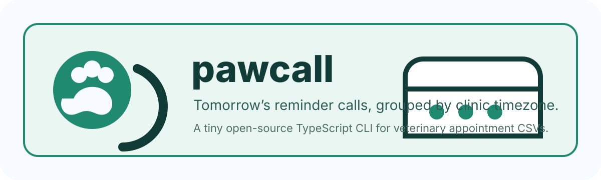

<p align="center">
  
</p>

# pawcall

A tiny TypeScript CLI for veterinary clinics. `pawcall` reads an appointments CSV and prints which pet owners need a reminder call tomorrow, grouped by the clinic's time zone.

## Install

```bash
npm install
npm run build
```

## Usage

```bash
npm run build
node dist/cli.js --file appointments.csv
```

For testing a specific current time:

```bash
node dist/cli.js appointments.csv --now 2026-10-03T23:30:00Z
```

## CSV format

Required columns:

| Column | Description |
|---|---|
| `clinic` | Clinic name |
| `timezone` | IANA timezone, such as `America/Los_Angeles` or `Asia/Karachi` |
| `appointment_at` | ISO date/time for the appointment. If no offset is included, pawcall treats it as local to `timezone`. |
| `owner_name` | Pet owner's name |
| `pet_name` | Pet's name |

Optional columns:

| Column | Description |
|---|---|
| `owner_phone` | Phone number to show in the reminder list |
| `reminder_call_required` | Set to `false`, `no`, `n`, or `0` to skip the row |
| `status` | `canceled` or `cancelled` appointments are skipped |

Example:

```csv
clinic,timezone,appointment_at,owner_name,pet_name,owner_phone,reminder_call_required,status
Happy Paws Vet,America/Los_Angeles,2026-10-04T09:30:00,Alex Chen,Mochi,+1-555-0101,true,confirmed
Karachi Pet Clinic,Asia/Karachi,2026-10-05T14:00:00,Sara Khan,Leo,+92-300-5550103,true,confirmed
```

Output:

```text
Timezone: America/Los_Angeles (2026-10-04)
  Clinic: Happy Paws Vet
    - 09:30 · Alex Chen for Mochi · +1-555-0101

Timezone: Asia/Karachi (2026-10-05)
  Clinic: Karachi Pet Clinic
    - 14:00 · Sara Khan for Leo · +92-300-5550103
```

## Development

```bash
npm install
npm test
npm run build
npm run check
```

CI runs `npm run check` on pushes and pull requests.

## Design concept

The mark combines a phone receiver, paw pad, and calendar reminder dot: practical, small, and clinic-friendly rather than enterprise-heavy.
